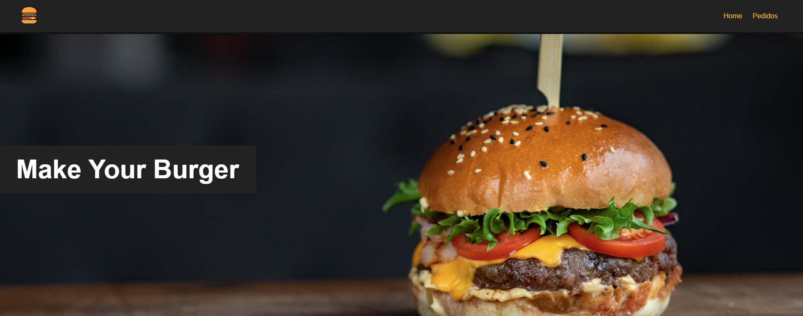
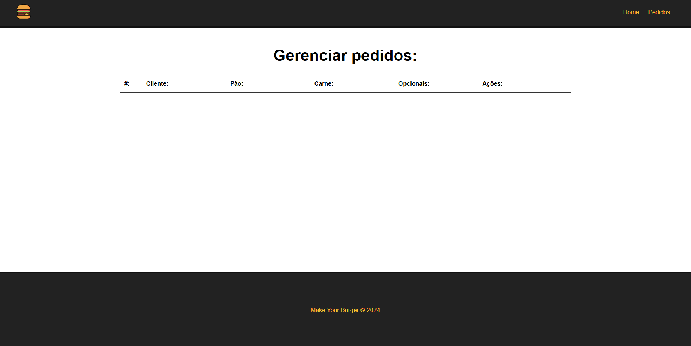

# Make Your Burger

Projeto Vue.js para montar e gerenciar pedidos de hambúrguer personalizados.

## Funcionalidades

- Cadastro de pedidos de hambúrguer
- Escolha de pão, carne e opcionais
- Visualização de pedidos
- Mensagens de confirmação

## Tecnologias Utilizadas

- Vue.js
- JavaScript
- HTML/CSS
- json-server (backend fake)

## Como rodar o projeto

### 1. Instale as dependências

```powershell
npm install
```

Ou, se preferir:

```powershell
pnpm install
```

### 2. Inicie o backend (API fake)

```powershell
npx json-server --watch db/db.json --port 3000
```

### 3. Inicie o frontend

```powershell
npm run serve
```

Ou:

```powershell
pnpm serve
```

Acesse o frontend em: [http://localhost:8080](http://localhost:8080)

## Estrutura de Pastas

```
├── db/
│   └── db.json           # Banco de dados fake
├── public/
│   └── img/              # Pasta para imagens públicas
├── src/
│   ├── assets/           # Imagens e arquivos estáticos
│   ├── components/       # Componentes Vue
│   ├── router/           # Rotas do projeto
│   └── views/            # Páginas principais
```

## Imagens das Telas

### Home



### Formulário de Pedido


### Pedidos



## Local para fotos do projeto

## Autor

- Matheus Alberto Rodrigues da Silva

---

Sinta-se livre para contribuir ou sugerir melhorias!
